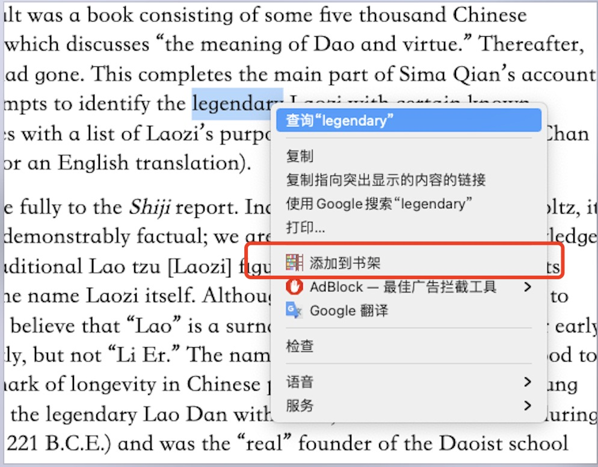
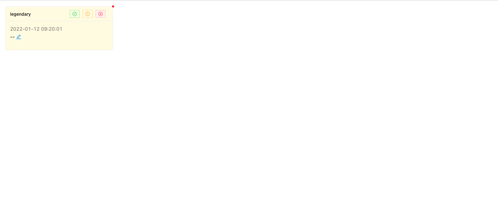

### what is this ?
 this is a chrome extension that allow you to add your unrecognized words to your local vocabulary bookshelf.
 and every time you open the new tab in chrome, you will see the words you have added.

### keywords
- vocabulary
- dictionary
- chrome extension

### features
- color the words you have added
- add words to the dictionary
- change the opacity of the words you have added
- remove words from the dictionary
- add description to the words
- modify the word if you want

 

### how to build local package?
```
git clone git@github.com:tsaowe/vocabulary.git
cd vocabulary
yarn install
yarn build
```

### how to install on chrome [chrome://extensions/](chrome://extensions/)
```
1. open url by chrome chrome://extensions/
2. at the top right corner, click "Developer mode", make sure the checkbox is checked
3. click "Load unpacked extension..."
4. choose the folder you just build, and click "Load"
5. click "Enable"
```

### how to use






### npn library
- create-react-app
- antd
- react-router
- ramda
- moment
- Dexie
